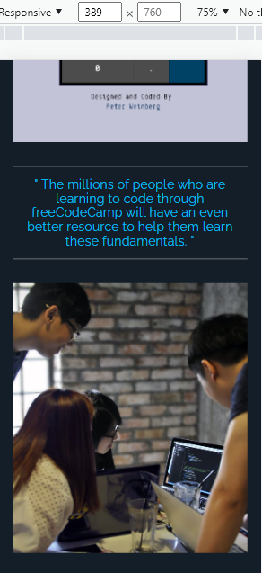

<h1 align='center'>Magazine Layout</h1>

  <a href="#-sobre">Sobre</a>&nbsp;&nbsp;&nbsp;|&nbsp;&nbsp;&nbsp;
  <a href="#-prints">Prints</a>&nbsp;&nbsp;&nbsp;|&nbsp;&nbsp;&nbsp;
  <a href="#-tecnologias">Tecnologias</a>&nbsp;&nbsp;&nbsp;|&nbsp;&nbsp;&nbsp;
    <a href="#-autor">Autor</a>&nbsp;&nbsp;&nbsp;|&nbsp;&nbsp;&nbsp;
  <a href="#-licença">Licença</a>&nbsp;&nbsp;&nbsp;|&nbsp;&nbsp;&nbsp;

🚀 Projeto concluído ✅

## 💻 Sobre

Este projeto é uma página de revista feita usando HTML e CSS. o projeto faz parte de um curso curso da [freeCodeCamp](https://www.freecodecamp.org/) sobre [desenvolvimento web responsivo.](https://www.freecodecamp.org/learn/2022/responsive-web-design/). No projeto foram usados recursos de layout Grid, media queries para design responsivo e variáveis CSS.  

## 📷 Prints

  

  

## 🛠 Tecnologias

- Linguagens: 
    - [HTML](https://developer.mozilla.org/pt-BR/docs/Web/HTML) 
    - [CSS](https://developer.mozilla.org/pt-BR/docs/Web/CSS)
- Ferramentas / Recursos: 
    - Editor: [Visual Studio Code](https://code.visualstudio.com/)
    - Fontes: [Raleway](https://fonts.google.com/specimen/Raleway?query=RAleway+), [Baskervville](https://fonts.google.com/specimen/Baskervville?query=Baskervville) e Anton
    - Ícones: [Fontawesome](https://fontawesome.com/)

## 🦸‍♂️ Autor

Feito com ❤️ by Gustavo Souza. 👋 [Entrar em contato](https://www.linkedin.com/in/gustavo-victor-575b93206/)

- GitHub - [@Gustavo-Victor](https://github.com/Gustavo-Victor)
- Frontend Mentor - [@Gustavo-Victor](https://www.frontendmentor.io/profile/Gustavo-Victor)
- CodePen - [@gustavo_victor](https://codepen.io/gustavo_victor)
- Linkedin - [@gustavo-victor](https://www.linkedin.com/in/gustavo-victor-575b93206/)

## 📝 Licença 

O projeto está sob a [Licensa MIT](./LICENSE) 

Qualquer pessoa pode usar, clonar e contribuir com este projeto 👍😁

